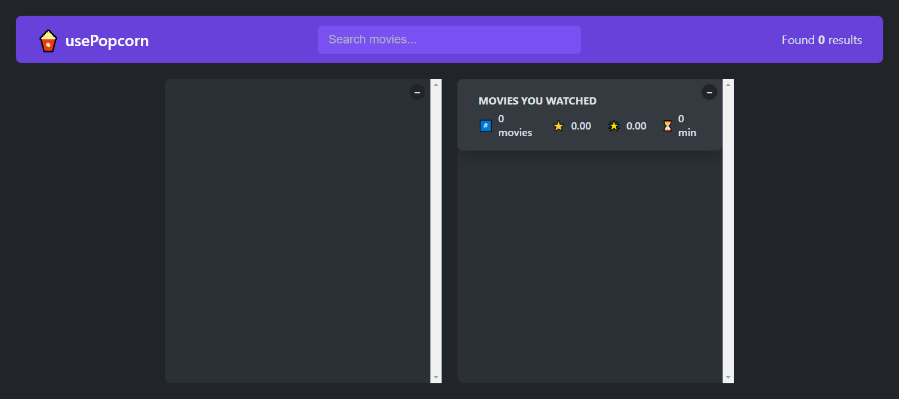

# 🍿 usePopcorn - Movie Exploration and Management App

**usePopcorn** is a React-based web application that enables users to explore movies, rate them, and manage their watched movies list effortlessly. By leveraging the **OMDB API**, the app provides access to a vast database of movies, allowing users to find detailed information, such as genre, cast, director, ratings, and much more. This project was created as part of a course by Jonas Schmedtmann.

---

## 📸 Screenshot



---

## 🔗 Links

- Github Repo: [Github-link](https://github.com/Mikiyas6/UsePopcorn)
- Live Site URL: [Page-link](https://usepopcornapp.netlify.app/)

---

## 🌟 Features

- 🔍 **Search for Movies**: Explore an extensive list of movies from the OMDB API using the search functionality.
- ⭐ **Rate Movies**: Add your personal ratings to movies after watching them.
- ✅ **Watched Movies List**: Maintain a list of movies you’ve watched, including runtime and user ratings.
- 📊 **Summary Statistics**: View average IMDb ratings, user ratings, and runtime of all the movies you've watched.
- 🎥 **Detailed Movie Info**: Fetch and display detailed information about a selected movie, including the plot, actors, and directors.

## 🛠️ Technologies Used

- **React**: For building the user interface.
- **OMDB API**: For fetching movie data.
- **Custom Hooks**: Includes hooks like `useMovies`, `useLocalStorageState`, and `useKey` to manage data and events efficiently.
- **React Context**: For state and event management.
- **CSS Modules**: For styling components.

## ⚙️ Installation

1. Clone the repository:
   ```bash
   git clone https://github.com/your-username/usePopcorn.git
   ```
2. Navigate to the project directory:
   ```bash
   cd usePopcorn
   ```
3. Install dependencies:
   ```bash
   npm install
   ```
4. Start the development server:
   ```bash
   npm start
   ```
5. Open the app in your browser at `http://localhost:3000`.

## 🌐 API Integration

This app uses the [OMDB API](http://www.omdbapi.com/) to fetch movie data.  
To use the application:
1. Obtain your API key from the [OMDB API website](http://www.omdbapi.com/apikey.aspx).
2. Replace the placeholder API key in the `MovieDetails` component with your API key:
   ```javascript
   const res = await fetch(
     `http://www.omdbapi.com/?i=${selectedId}&apikey=your_api_key_here`
   );
   ```

## 🧩 Project Structure

```plaintext
src
├── components
│   ├── App.js                # Main application component
│   ├── MovieList.js          # Displays the list of movies
│   ├── MovieDetails.js       # Displays detailed movie info
│   ├── WatchedMovieList.js   # Manages the watched movies list
│   └── StarRating.js         # Custom star rating component
├── hooks
│   ├── useMovies.js          # Fetches movies from OMDB API
│   ├── useLocalStorageState.js  # Persists state to localStorage
│   └── useKey.js             # Handles keypress events
├── styles
│   └── styles.css            # Global styles for the app
└── index.js                  # Entry point of the application
```

## 🎮 How to Use

1. Use the search bar to find your favorite movies by title.
2. Click on a movie to view its details, including plot, cast, and IMDb rating.
3. Add the movie to your watched list after rating it.
4. View the watched movies summary to analyze your movie-watching habits.

## ✨ Highlights

- **Dynamic UI**: Reactively updates as you interact with the app.
- **Keyboard Shortcuts**: Use the `Enter` key to focus on the search bar or the `Escape` key to close movie details.
- **Persistent Data**: Watched movies are stored in localStorage, ensuring your list remains even after refreshing the page.

## 🖼️ Screenshots

### Search and Explore Movies


### Movie Details


### Watched Movies Summary


## 🚀 Future Enhancements

- 🎬 Add a feature to recommend similar movies based on genres.
- 💾 Enable user accounts for personalized movie lists.
- 🌍 Introduce support for multilingual movie details.

## 🧑‍💻 Author

This project was built by **Mikiyas Tewodroes** as part of Jonas Schmedtmann’s React course.  
Feel free to connect with me on [LinkedIn](linkedin.com/in/mikiyas-teowodroes).

